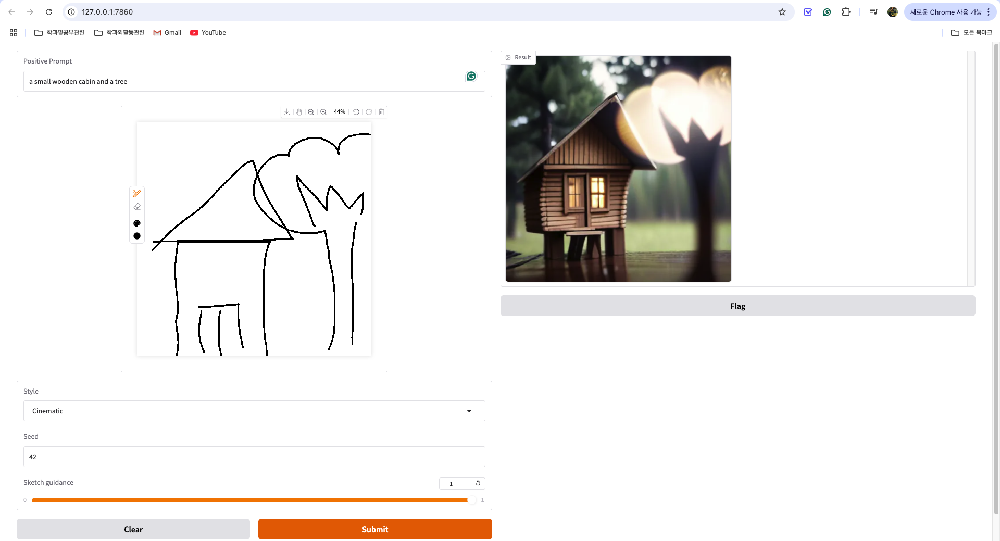

## Generating Image from Sketch with ComfyUI, Websocket, and Gradio



### Setup
This tutorial requires `ComfyUI` for all backend image generation pipeline.  
Install `ComfyUI` [here](https://www.comfy.org/download).

Refer to `workflow.json` to configure the ComyfyUI workflow. We recommend using the following models:
- [Juggernaut X](https://huggingface.co/mojen/Juggernaut_X/blob/main/Juggernaut_X_RunDiffusion.safetensors) for diffusion checkpoint.
- [This Control Net](https://huggingface.co/xinsir/controlnet-union-sdxl-1.0/blob/main/diffusion_pytorch_model_promax.safetensors).

Then, in terminal, install dependencies:

```bash
pip install requirements.txt
```

Configure `settings.py`:

```python
SERVER_ADDRESS = "127.0.0.1:8000" # running ip
COMFYUI_PATH = "/path/to/ComfyUI" # path to your installed ComfyUI
```

Finally, simple run: 
```bash
python main.py
```